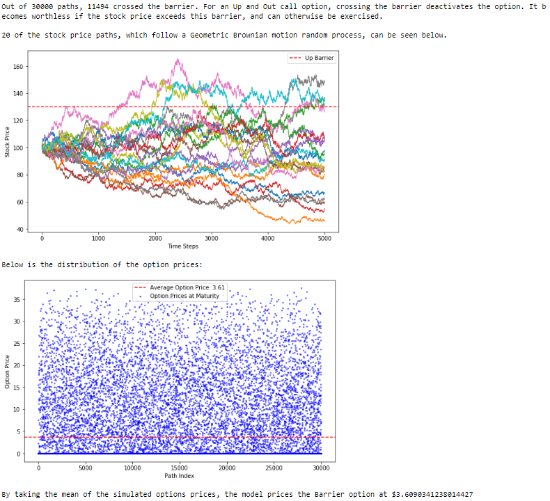

# Explainable Options Pricing Modeling

## Overview
This project implements explainable models focusing on the pricing of financial derivatives, specifically various types of options. The key features of this project include handling American exercise rights, dividends, stochastic volatility, and types of exotic options. 

Before getting into specific details, it's important to understand the basics: 

## What is an Option?
An option is a financial derivative that gives the buyer the right, but not the obligation, to buy (in the case of a call option) or sell (in the case of a put option) an underlying asset at a predetermined price (called the Strike price) on (European option) or anytime before (American option) an expiry date. Options are used for hedging against risks, speculating on future price movements, or enhancing investment income.

## Option attributes
Some of the attributes of an option are:
- **$S_0$ (float)**: Current price of the underlying asset.
- **$K$ (float)**: Strike price of the option.
- **$R$ (float)**: Time to expiration of the option, measured in years.
- **vol $(\sigma)$ (float)**: Volatility of the underlying asset.
- **div (float)**: Dividend yield of the underlying asset.

The two main types of options are calls (right but not obligation to buy the stock) and puts (same thing for selling the stock). Furthermore, there are several flavors of options. The ones we will be considering in the project are:
- **European options**: A European option is a type of financial derivative that can only be exercised at the end of its life, at its expiration.
- **American options**: Similar to the European option, but it can be exercised at any time before and including the day of expiration.
- **Digital options**: Also known as a binary option, this pays out a fixed amount if the underlying asset is above (call) or below (put) a certain price at expiration.
- **Barrier options**: A type of option where the payoff depends on whether the underlying asset's price reaches a certain level (the barrier) during a specific period.
	- **Types**:
		- **Up-and-In**: Becomes active if the asset price hits a set upper barrier.
		- **Up-and-Out**: Expires worthless if the asset price hits a set upper barrier.
		- **Down-and-In**: Becomes active if the asset price hits a set lower barrier.
		- **Down-and-Out**: Expires worthless if the asset price hits a set lower barrier.

## Project Objectives
- **Enhance Interpretability**: By providing detailed explanations and comparisons of different pricing models, this project aims to make the pricing of options more understandable rather than just using esoteric closed formulas (though we do use these as a benchmark).
- **Expand Core Binomial Model**: Enhance the core binomial model to accommodate real-world complexities such as dividend-paying stocks, American options, and stochastic volatility. This enhancement addresses limitations of the basic model and improves accuracy by reflecting more realistic market conditions. Incorporating dividends ensures that the model accurately captures the impact of cash payouts to shareholders on option prices. Integrating American options capability enables the pricing of options with early exercise features, which is crucial for accurately valuing options in markets with uncertain future volatility. Additionally, incorporating stochastic volatility models allows for better representation of the volatility dynamics observed in real markets, leading to more accurate pricing predictions.
- **Price Complex Exotics**: Develop models capable of pricing complex exotic options (digital and barrier options). These options often possess intricate payoff structures and features, making them challenging to price accurately. By developing models that can accurately price these exotic options while maintaining interpretability, this project aims to simplify the understanding of complex option pricing and reduce the complexity involved in explaining the details of their pricing mechanisms.

## Importance and Interest of the Project

### Advancing Financial Models
- **Enhanced Accuracy**: Integrating advanced features like stochastic volatility and American exercise options, the project extends beyond traditional models like Black-Scholes. This approach offers more precise pricing under diverse market conditions.
- **Complex Options Handling**: The capability to accurately price exotic options such as barrier and digital options without having to rely on esoteric closed-form formulas.

### Explainability and Decision Support
- **Enhancing Interpretability**: Unlike traditional models that rely on complex mathematical formulas, this project emphasizes explainability. Each component of the model is designed to provide clear insights into how pricing decisions are made, which is crucial for users who need to understand the rationale behind model outputs.
- **Explanatory Visualizations**: Through detailed visualizations and step-by-step breakdowns of the pricing processes, the project makes advanced financial concepts accessible and comprehensible to users without a deep mathematical background (though it still requires a solid finance background).


## Project Capabilities

## Implementation of Binomial Model + Enhancements
**Incorporation of Dividends**: Expanded the binomial model to account for dividend-paying stocks, allowing for more accurate pricing of options on such assets.

**Support for American Options**: Extended the binomial model to handle American options, enabling the pricing of options with early exercise features, which is crucial for markets with uncertain future volatility.

To use the BinomialModel for pricing an option, follow these steps:

Define the option parameters:
```python
o = Option(spot_price=100, strike=98, maturity=1.5, volatility=0.3, dividend_yield=0, is_call=True, option_type="European")
```

Instantiate the BinomialModel with the option and risk-free rate:
```python
b = BinomialModel(option=o, risk_free_rate=0.1)
```

Obtain the price of the option using the `get_price()` method:
```python
price = b.get_price()
```
	
This will produce an output such as:


Note that the output includes the stock and option values of the nodes in the tree, including the probabilities of up and down moves. This makes it easy to understand how the option values are calculated since you can see the value at every stage.

Here is an example of using the Binomial model to price an American call option on a dividend paying stock:

```python
o = Option(spot_price = 100, strike = 97, maturity = 1.25, volatility = 0.15, dividend_yield = 0.1, is_call = True, option_type="American")
b = BinomialModel(option = o, risk_free_rate = 0.1, num_time_steps=10)
b.get_price()
```


For an American option, the model nicely indicates at which nodes it is optimal to early exercise by coloring them green.

## Stochastic Volatility Model
Traditional models, like the binomial model, assume static volatility, which can be an oversimplification. The Heston Model addresses this by introducing stochastic volatility, allowing volatility to fluctuate over time. This enhancement is crucial for accurately pricing European options, as it aligns the model more closely with real market behaviors where volatility is dynamic and uncertain.

### The Heston Model Explained
The Heston model is particularly well-suited for pricing European options, which do not have the early exercise feature of American options. It employs two stochastic processes: one for the underlying asset price and one for its variance, with the following dynamics:

$$
\begin{align*}
\text{Asset Price:} \quad dS_t &= r S_t dt + \sqrt{v_t} S_t dW_{S_t} \\
\text{Variance:} \quad dv_t &= \kappa (\theta - v_t) dt + \sigma \sqrt{v_t} dW_{v_t}
\end{align*}
$$

where:

- $S_t$ is the stock price at time $t$.
- $r$ is the risk-free interest rate.
- $v_t$ is the variance of the stock price at time $t$.
- $\kappa$ represents the rate at which variance reverts to its long-term mean $\theta$.
- $\theta$ is the long-term variance.
- $\sigma$ denotes the volatility of volatility.
- $\rho$ is the correlation coefficient between the Wiener processes $W_{S_t}$ and $W_{v_t}$.

We can use the Heston model to price a European call as follows:
```python
o = Option(spot_price = 100, strike = 100, maturity = 1, volatility = 0.15, dividend_yield = 0, is_call = True, option_type="European")
h = HestonModel(option = o, risk_free_rate = 0.07, kappa = 2, theta = 0.35, sigma = 0.1, rho = -0.5)
h.get_price()
```
which produces the output


The output includes 3 graphs:
- **Vol paths**: Firstly, the model outputs a graph of some of the volatility paths produced in the simulation. These volatility paths are producing using the mean-reverting square root stochastic process described earlier.
- **Stock price paths**: Next, the model outputs a graph of some of the stock price paths produced in the simulation. These stock price paths are producing using the Geometric Brownian motion process described earlier, and allow for stochastic volatility.
- **Option prices distribution**: Lastly, the model outputs a graph of the option prices distribution, which allows for interpretability of the MC simulation and shows how the average price was determined.

## Digital Options Pricing
**Digital Option Pricer**: Implemented a Digital Option Pricer using Monte Carlo simulation, providing a method for pricing digital options and visualizing their terminal prices.

### Mathematical Process
The terminal stock price at expiration is modeled using a log-normal distribution, assuming that returns are normally distributed:

$$
S_T = S_0 \cdot e^{(r - \frac{\sigma^2}{2})T + \sigma \sqrt{T} Z}
$$

where:
- $S_0$ is the initial stock price.
- $r$ is the risk-free interest rate.
- $T$ is the time to expiration.
- $\sigma$ is the volatility of the stock.
- $Z$ is a standard normal random variable.

Given the terminal stock prices, we count the number of times the option expires in the money (either $S_T > K$ for calls or $S_T < K$ for puts) and use this to estimate the option's value:

$$
\text{Option Price} = e^{-rT} \times \frac{\text{Number of Paths In The Money}}{\text{Total Number of Paths}}
$$

We can use the model to price a digital call as follows:
```python
o = Option(spot_price = 100, strike = 100, maturity = 1, volatility = 0.35, is_call = True, option_type="Digital")
p = DigitalOptionPricer(option = o, risk_free_rate = 0.05)
p.get_price()
```
which produces the output


The output includes outputs 2 graphs:
- **Terminal stock prices**: The model outputs a graph that shows the distribution of terminal stock prices and which are in the money and would be exercised.
- **Option prices distribution**: The model also outputs a graph of the option prices distribution, which allows for interpretability of the MC simulation and shows how the average price was determined.

This allows for explainability, since it becomes easy to see how often the digital call was in the money. The options price graph also shows that there is a balancing act between the option being exercised for the fixed amount of profit or becoming worthless.

## Barrier Options Pricing
**Barrier Option Models**: Designed models capable of pricing all 4 types of barrier options.

## Pricing Methodology
The pricing method simulates stock price paths using the formula for geometric Brownian motion:

$$
dS_t = r S_t dt + \sigma S_t dW_t,
$$

where $r$ is the risk-free rate, $\sigma$ is the volatility, and $dW_t$ represents the increments of a Wiener process (standard Brownian motion).

### Steps in the Simulation:
**Generate Paths**: Simulate paths for the underlying asset's prices up to the expiration date using the discretized version of the geometric Brownian motion equation.

**Calculate Payoffs**: For each path, determine if the barrier condition was met (crossed) and compute the payoff accordingly.

**Apply Barrier Adjustment**: Adjust the barrier by a factor derived from the Riemann zeta function to account for discretization error:

   $$
   \text{Adjusted Barrier} = B e^{\pm \beta_1 \sigma \sqrt{\Delta t}},
   $$
   
   where $\beta_1 = -\frac{\zeta(1/2)}{\sqrt{2\pi}}$ and $B$ is the original barrier level.

### Payoff Calculation:
The payoffs are calculated based on the barrier type. For 'Out' types, the option expires worthless if the barrier is breached, while for 'In' types, the option only becomes active if the barrier is crossed.

We can use the model to price a Up and Out barrier call as follows:
```python
o = Option(spot_price = 100, strike = 90, maturity = 1, volatility = 0.3, barrier = 130, is_call = True, option_type="Barrier")
p = BarrierOptionPricer(option = o, risk_free_rate = 0.05, barrier_type = "Up and Out")
p.get_price()
```
which produces the output



The model outputs 2 graphs:
- **Stock price paths**: The model outputs a graph that shows the paths of the stock prices, which follow a Geometric Brownian Motion random process. This graph clearly shows the barrier and makes it easy to see examples of stock price paths that crossed the barrier and did not cross the barrier.
- **Option prices distribution**: The model also outputs a graph of the option prices distribution, which allows for interpretability of the MC simulation and shows how the average price was determined.

The model also outputs the number of stock price paths that crossed the barrier along with an explanation of what crossing the barrier means for the specific type of barrier option. This makes it easy to understand the option pricing decision, since these two outputs in combination determine whether the option will mostly be exercised or become worthless.